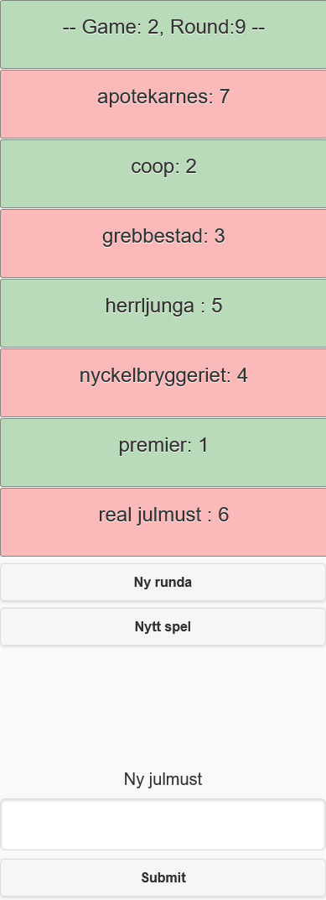
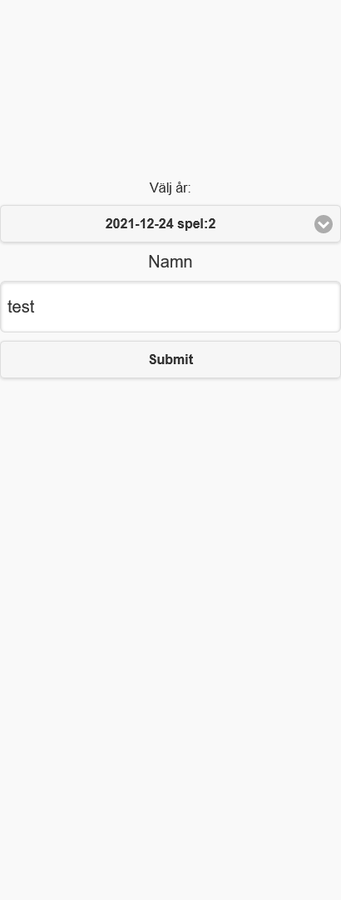
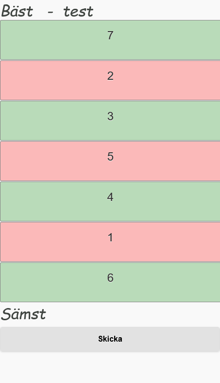
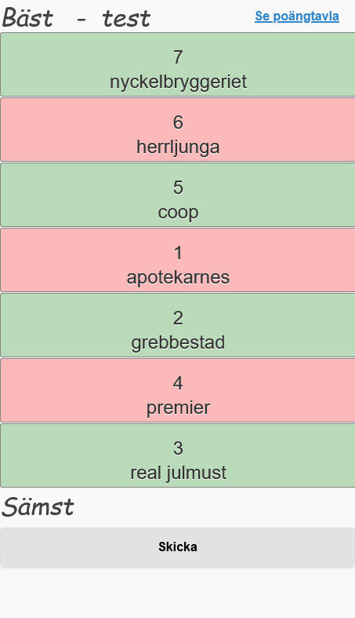
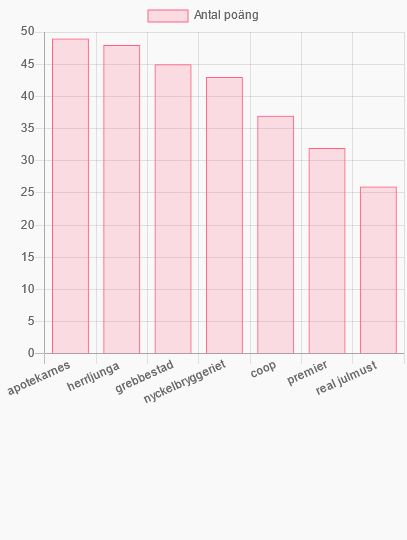

# Must-spel

Spel för användning av provning av julmust

## Start
För att starta spelet kör
```
python start.py
```
Anslut till localhost:5000
## Spelets gång
Sidan startas genom att spel ansvarig går in på sidan localhost:5000/gamemaster
Där kan den ansvariga skapa nytt spel starta ny runda för att slumpa fram ny siffror för dryckerna.
Dessutom kan man lägga till mer julmustsorter dessa kommer att visas när en ny runda startas.



Spelarna kan ansluta sig genom att skriva in sitt namn vid localhost:5000. De kan dessutom välja tidigare omgångar för att se vad de svarat tidigare.



När spelaren har anlutit sig så kan den välja vilken julmust de gillade best genom att sortera de efter den som är högst upp är den man gillade mest och den längst ner sämst.



När spelaren är klar kan den skicka in det. för att svaret ska skickas in måste spelansvarig skapa en ny runda.



När spelaren har skickat in resultatet så kan den kolla vilken julmust som ligger bäst till genom att klicka på poängtavla.




